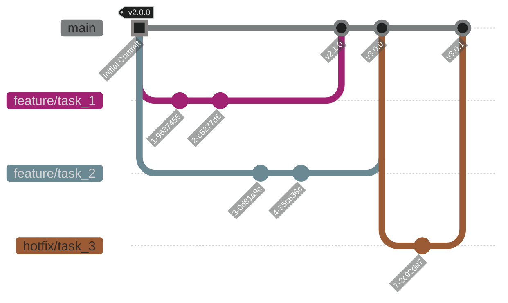

- [How to contribute (developer guide)](#how-to-contribute-developer-guide)
  - [Branching scheme](#branching-scheme)
  - [Example workflow with git bash](#example-workflow-with-git-bash)

# How to contribute (developer guide)

## Branching scheme
A general minimal branching scheme is shown below:



'main' receives continuous software updates by the users (direct commits are prohibited).
Branches like 'feature/task_n' as well as 'hotfix/task_m' are the work task branches. 
Users will adapt/update their code and commit their changes here.
In order to update 'main' with the content of the task based branches, a review process is engaged via a
'Pull Request' in Github.

## Example workflow with git bash

**Target:** Create a *feature* branch from *main*
```bash
git checkout main
git pull origin main
git checkout -b feature/<small_content_description>
```

**Target:** Commit your changes

At first you need to add your changes. In case that you don't want to commit your whole workspace of changes,
you can manually stage your files and commit them to your local repository afterwards.
```bash
git add ./path/to/your/file
git commit -m "This is a meaningful commit message"
```

In case that you just want to add and commit all changes you can go with
```bash
git commit -a -m "This is a even more meaningful commit message"
```
instead.

Now you committed your changes to your local repository. In order to sync that with the remote repository,
you need to push your changes to the remote server
```bash
git push origin feature/<small_content_description>
```

This process is repeated until you close your branch e.g. via a merge to the main branch.
Then you create another branch for the next feature.


